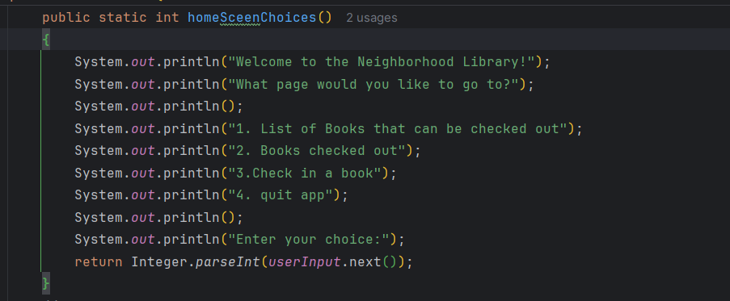
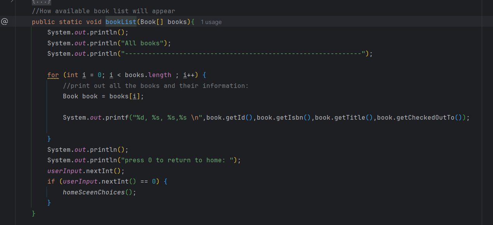
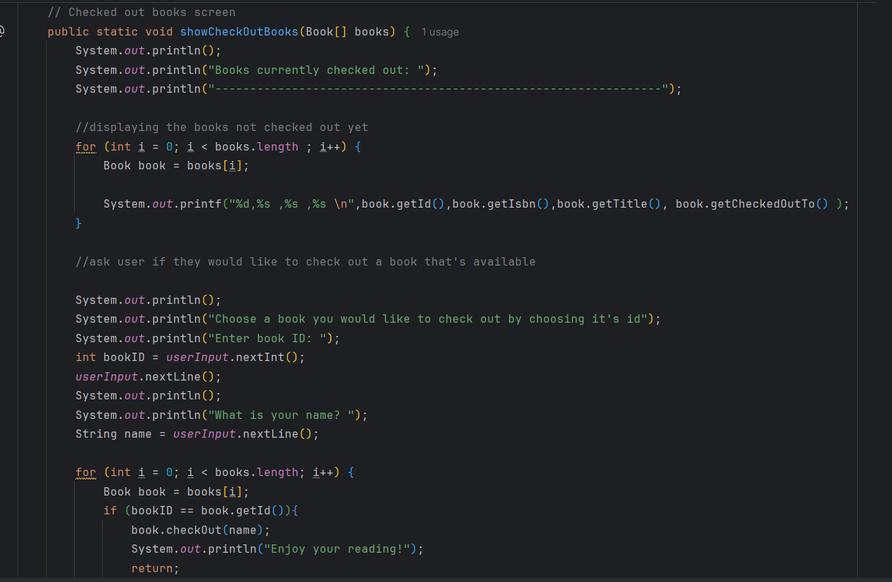
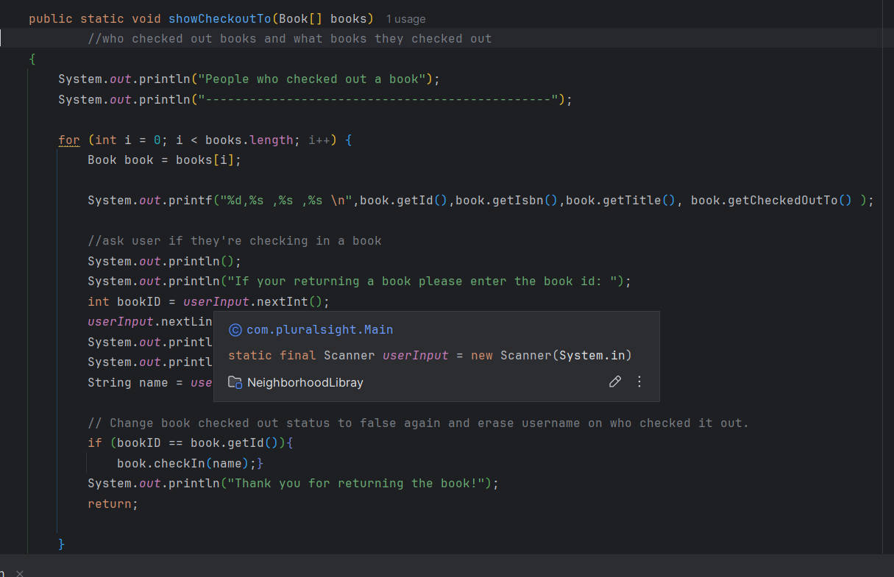

# neighborhood-library

Usage:
A simple application to check out books for a libarary with 20 books.
Has 4 screens :
- Home screen

- Book list screen

- Check out books screen

-	Check in books screen

Home screen will display first asking what would you like to do and display the options of the other 3 screens(Book list screen, check out books screen and check in books screen) and will let you quit the application. The numbers displayed are the only ones you could press to move to the other screens.

Books list screen:
Will display only books that are available to check out and pressing 0 allows you to return. Wanted to keep it simple so if it was up there on the list, then you could check it out on the check out screen.

Check out books screen:
Will prompt the user to enter a book id and the user’s name to check out the book while also clearing it off the book list so no other user can try to check out the same book. Dispalys the books so the user can see the avaiable books incase they forget the ID code they needed.

Check in book screen:
Allows you to check in the book by entering the book id. It also displays the books that are checked out and shows the ID making it easy for the user to remember what the code was. To keep it simple like everything else when the user is returning the book they just have to press the space key to clear there name after they enter the book ID. To avoid it looping I had the application return the user back to the home screen.

Current known bugs/issues:

Home screen:
-Will sometimes have to enter the number you pressed twice to go to the screen you want to go to.

Book list:
-Have to hit 0 twice to return to the main menu

Check out books screen:
-Will still show book that someone has.

